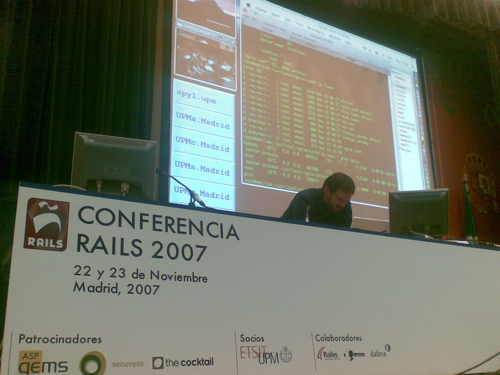
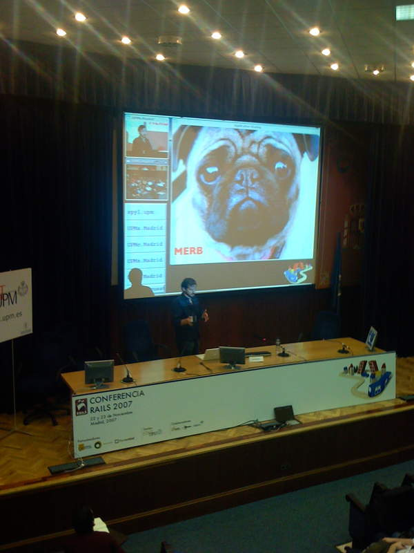
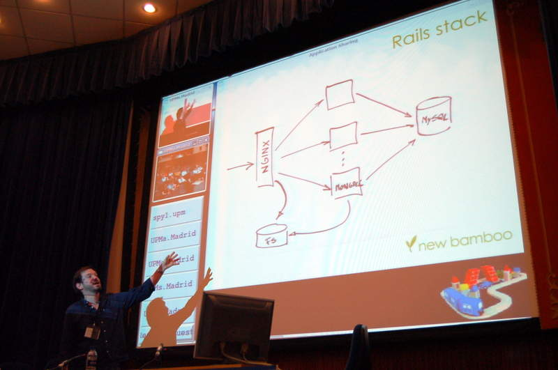

## Intro

I escaped London for a few days to go to Conferencia Rails 2007 in Madrid. There I gave a talk about much ranted Rails Scalability.

The title of the talk in spanish was "Escalabilidad y las cosas de las que nadie se atrevio a hablar".

Summary of the talk:

* Architecture and typical Rails deployment configurations.
* Use of Nginx as a static assets server.
* Mongrel and Evented Mongrel.
* Multithreaded image Uploads with mongrel and/or merb (instead of attatchment_fu)
* Activerecord optimizations (hacks, active_record_context plugin)
* Caches, pasive expirations. Cache observing daemons.
* Configuration and monitoring of a production Server. (monit, munin tools)

Here is the video of the talk, and of course, the slides.



The talk went fine, I have had so much fun speaking spanish again.

Here are some photos:




