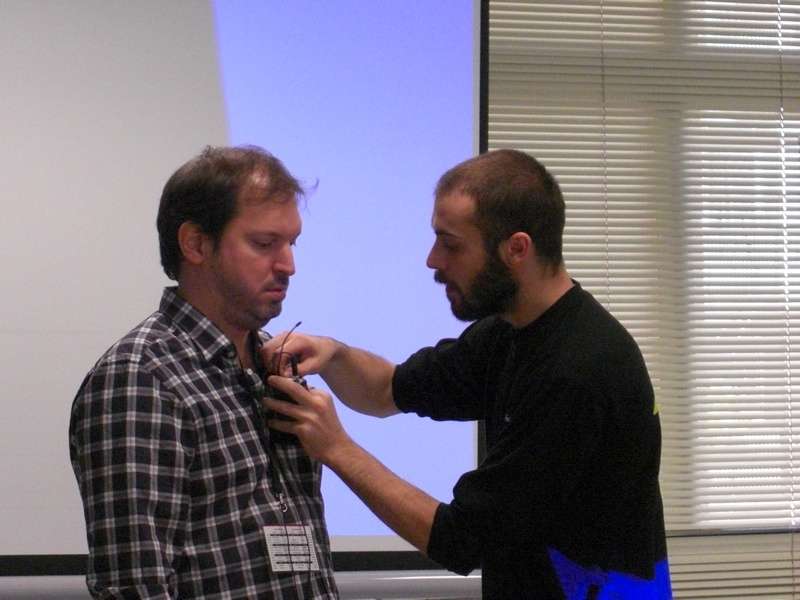
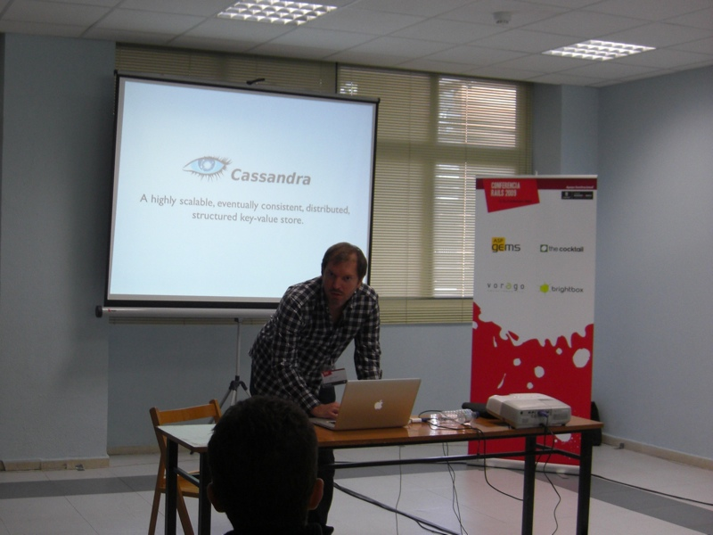
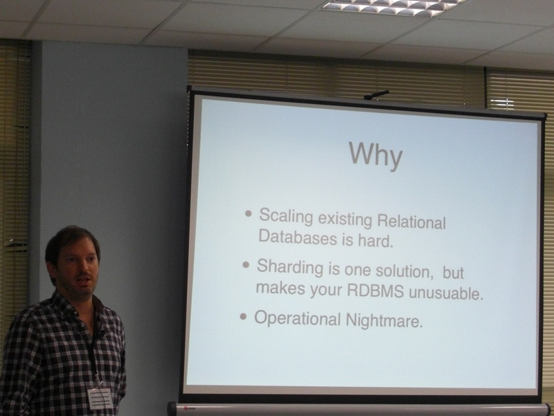
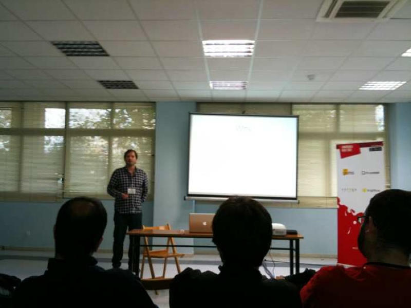

I been speaking about Apache Cassandra database at the Spanish Rails Confenrence 2009.

The title of my talk was [Cassandra DB: ¿Qué tienen Facebook, Twitter y Digg en común?](http://app.conferenciarails.org/talks/42-cassandra-db-que-tienen-facebook-twitter-y-digg-en-comun)





Here are some photos of the talk:




