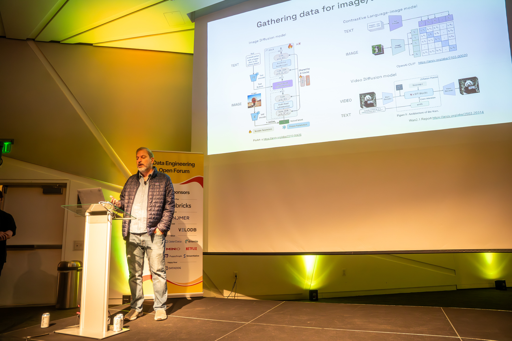
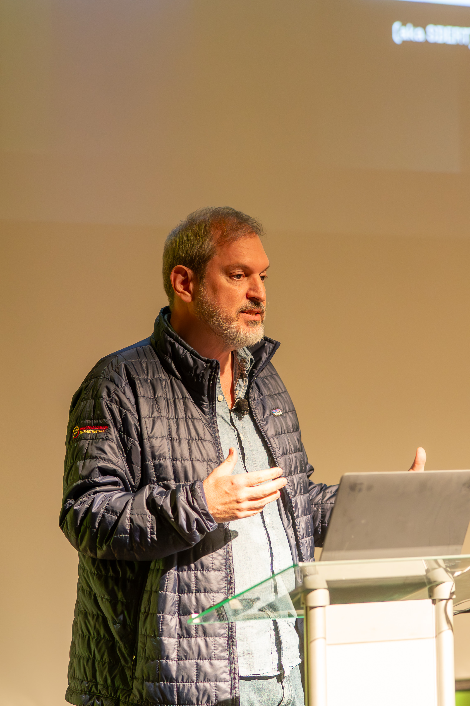
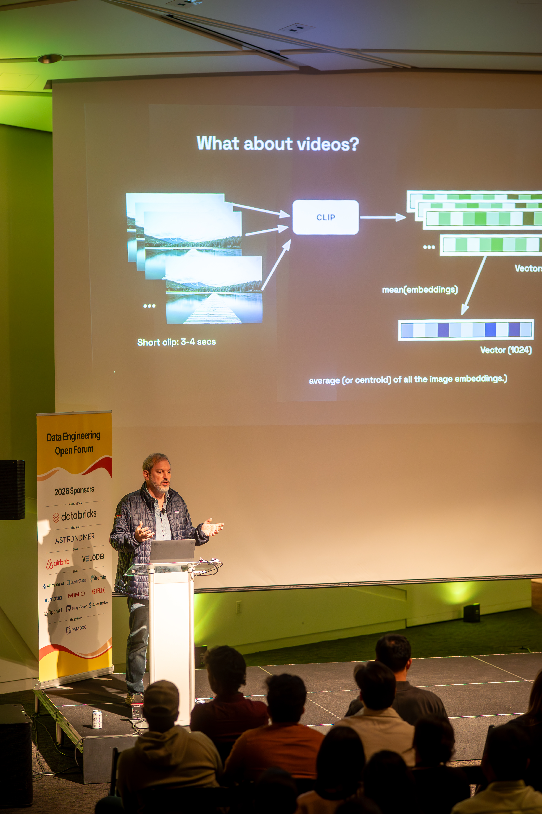

ABSTRACT:

As multimodal models mature, the challenge increasingly shifts from model architecture to feature engineering and dataset construction at scale. In this talk, we’ll share how Netflix builds and curates multimodal features across large video and image corpora, with LanceDB serving as the core storage and query layer for multimodal data.

We’ll briefly cover how Ray powers distributed ingestion, filtering, and large-scale batch inference across hundreds of GPUs, enabling the application of modern vision-language models to extract rich multimodal embeddings from video and image data. These embeddings capture both low-level visual signals and higher-level semantic context, forming the foundation for downstream tasks such as search, retrieval, and dataset curation.

We’ll examine how multimodal feature extraction enables semantic search, filtering, and exploration over large video collections, supporting queries expressed as natural language, images, or combinations of both. We’ll discuss how extracted features encode attributes such as scene composition, lighting, mood, and subject matter, enabling practical use cases like content filtering and targeted dataset selection in addition to semantic retrieval.

Finally, we’ll dive into how LanceDB's multimodal lakehouse serves as the high-performance storage and query layer for these features, enabling sub-second search over hundreds of terabytes of data, along with efficient sampling and diversity-aware dataset refinement across the data curation lifecycle. Built on the Lance columnar file format, this architecture is optimized for storing and querying large-scale multimodal embeddings and metadata efficiently. By treating multimodal features as first-class data assets, LanceDB enables scalable retrieval, dataset analysis, and production workflows that support continuous improvement of high-quality training data for text-to-image and video-to-text research.

Session



Some photos 




